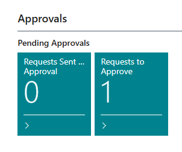
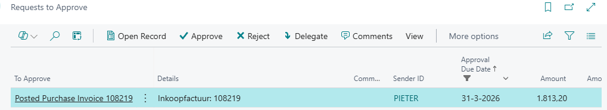

# Manual Approve Posted Purchase Invoices

In Business Central, the approval flow for purchase invoices is placed before posting by default. This is intended to be logical, but from an accounting perspective, it is a problem.

## Approve Posted Purchase Invoice

The approver will see in the start page of BC, that there is an approval request:

The approver can now approve the invoice. The On Hold code will be removed and status of the posted purchase invoice will be set from Pending Approval to Released.

The approver can also Reject the approval request.

[:arrow_left:](../README.md) [Back](../README.md)