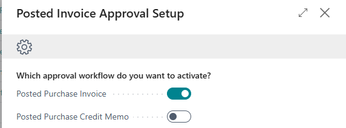

# Manual Approve Posted Purchase Invoices

In Business Central, the approval flow for purchase invoices is placed before posting by default. This is intended to be logical, but from an accounting perspective, it is a problem.

## Assisted Setup

When you install the app, you will be asked which approval flow you want to activate.

In this manual only the approval flow for the posted invoices is activated.

After selecting, you can press Finish.

The functionality is now ready to be used.

[:arrow_left:](../README.md) [Back](../README.md)
