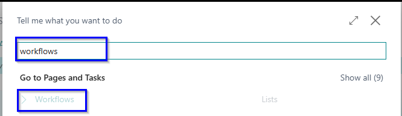
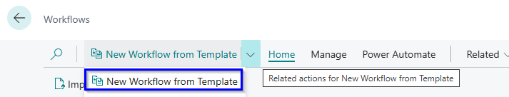
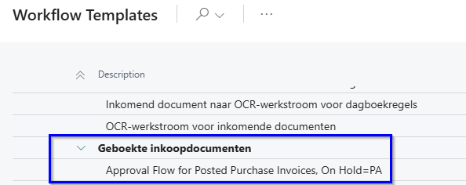
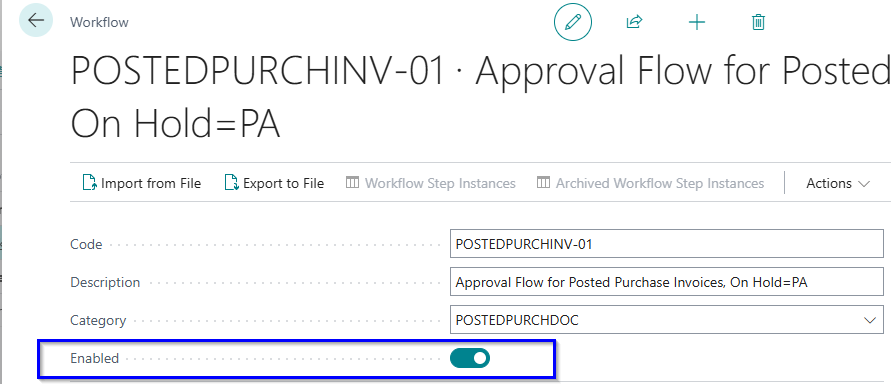

# Posted Invoice Approval

In Business Central, the approval flow for purchase invoices is placed before posting by default. This is intended to be logical, but from an accounting perspective, it is a problem.

The solution is the **Posted Invoice Approval** app. The invoice is posted immediately and is therefore visible in your reporting. However, release for payment only occurs after approval.

## Create workflow

Choose the icon , Enter Workflow, and the choose the related link.

Create a new workflow from a template.

Select Approval Flow for Posted Purchase Invoices, On Hold= PA.

The workflow is now created, you only have to **enable** it.

[:arrow_left:](../README.md) [Back](../README.md)
