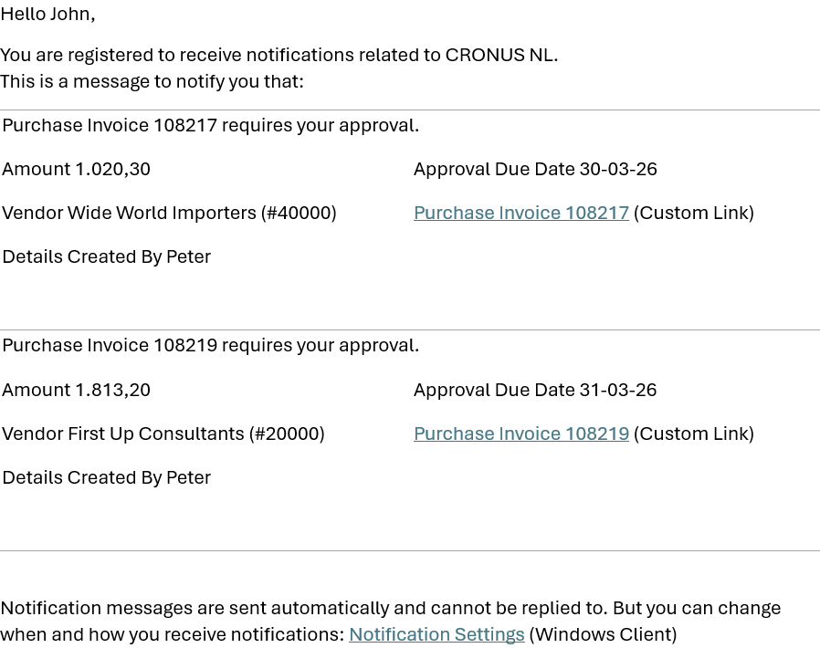

# Posted Invoice Approval

In Business Central, the approval flow for purchase invoices is placed before posting by default. This is intended to be logical, but from an accounting perspective, it is a problem.

The solution is the **Posted Invoice Approval** app. The invoice is posted immediately and is therefore visible in your reporting. However, release for payment only occurs after approval.

## E-mail

The approver is periodically notified via an e-mail that documents requires approval.

[:arrow_left:](../README.md) [Back](../README.md)
