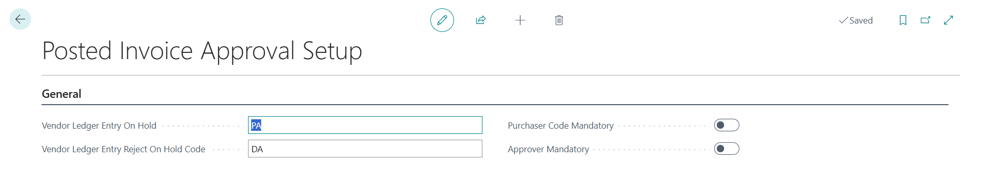

# Posted Invoice Approval

In Business Central, the approval flow for purchase invoices is placed before posting by default. This is intended to be logical, but from an accounting perspective, it is a problem.

The solution is the **Posted Invoice Approval** app. The invoice is posted immediately and is therefore visible in your reporting. However, release for payment only occurs after approval.

## Posted Invoice Approval Setup

BC will use the ON HOLD field to 'block' the invoice for payment.

When a posted purchased invoice is rejected by the approver, a separate on hold code is filled. This can be maintained in the Posted Invoice Approval Setup.

[:arrow_left:](../README.md) [Back](../README.md)
