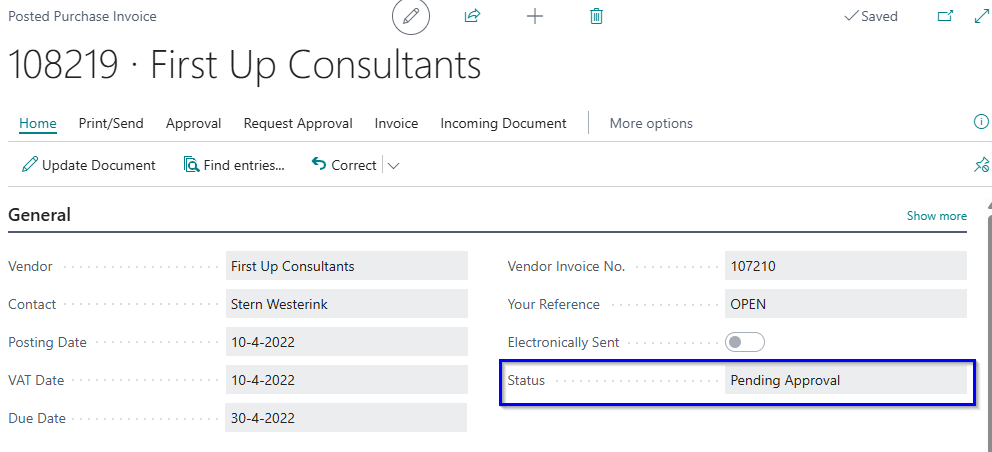
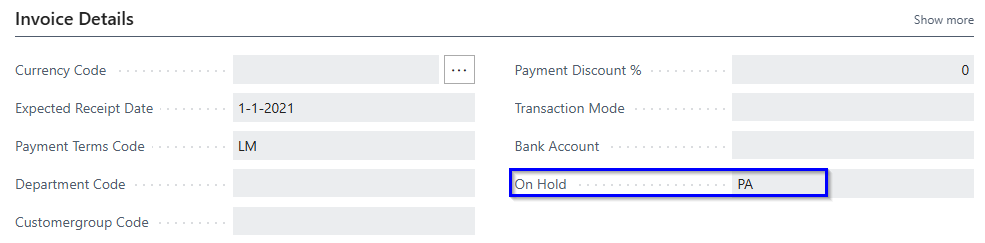
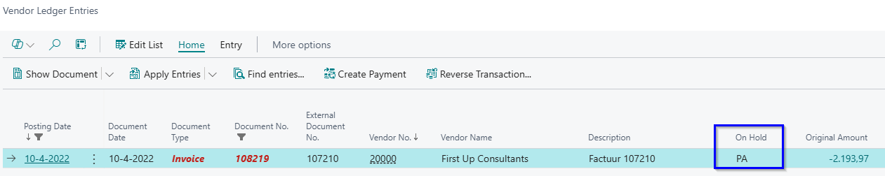

# Manual Approve Posted Purchase Invoices

In Business Central, the approval flow for purchase invoices is placed before posting by default. This is intended to be logical, but from an accounting perspective, it is a problem.

## Posted Purchase Invoices

When a purchase invoice is posted in BC, the on hold code will now be filled in the posted purchase invoice.

The invoice is automatically send for approval, so the status of the posted purchase invoice is now Pending Approval.

The on hold code is also filled on the **vendor ledger entry**.

[:arrow_left:](../README.md) [Back](../README.md)
