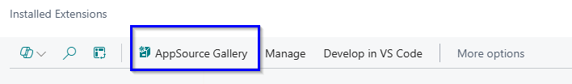
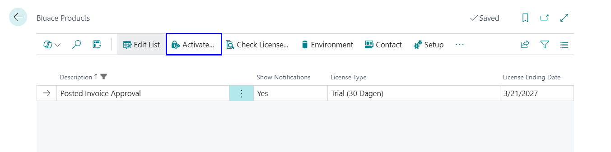
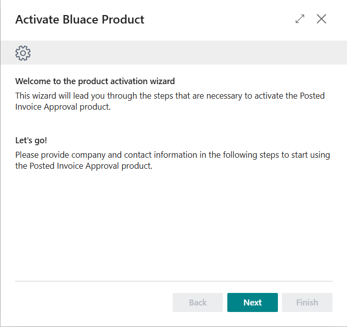
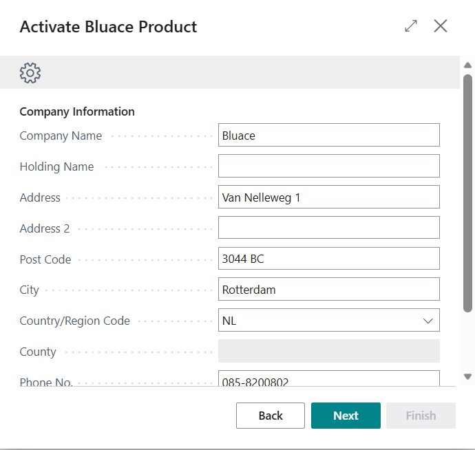
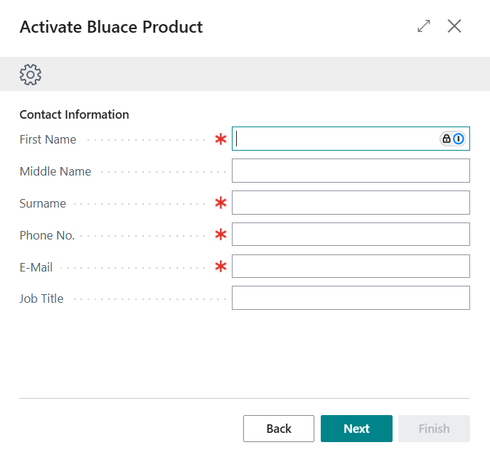
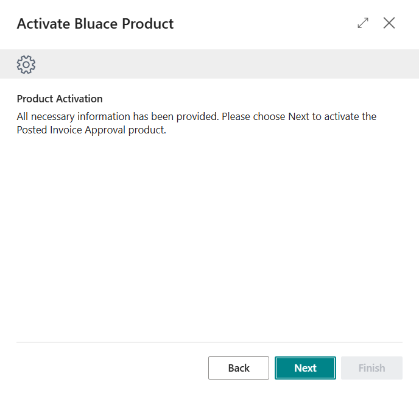
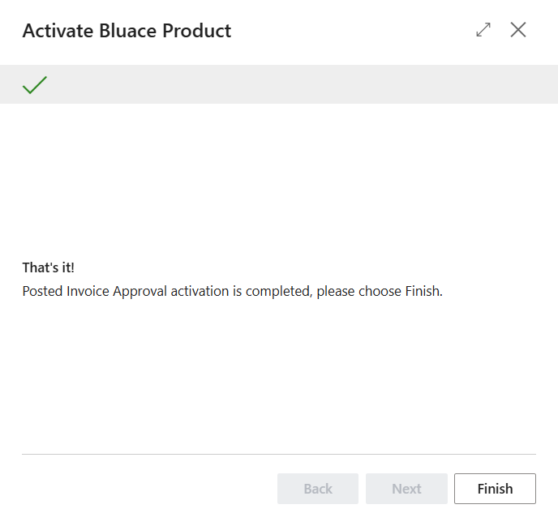

# Posted Invoice Approval

In Business Central, the approval flow for purchase invoices is placed before posting by default. This is intended to be logical, but from an accounting perspective, it is a problem.

The solution is the **Posted Invoice Approval** app. The invoice is posted immediately and is therefore visible in your reporting. However, release for payment only occurs after approval.

## Prerequisites

### Installation

The following procedure shows how to install the extension through the Extension Management page.

1. Choose the icon , Enter Extension Management, and the choose the related link.

2. Choose from the menu AppSource Gallery.

3. In the AppSource Apps for Business Central search for Posted Invoice Approval

4. Select the App.

5. Select Get It Now.

6. Choose from the menu the Deployment Status action.

7. Check if the status is Complete

### Activation
Once Technical Management NL is installed from the Microsoft AppSource by a Business Central SUPER user, go to the page Bluace Products in Business Central.
This is where you can activate the Posted Invoice Approval app.

Please supply the company information in the second step.

Please supply the contact information in the third step. This person will also be contacted and e-mailed about the license.

### Assigning permission sets
Please make sure that the permission set *POSTEDINVAPPRWBLC* is assigned to the users that will use the Posted Invoice Approval functionality. It’s also possible to create derived permission sets, to assign subsets of permissions to groups of users. To make sure that future developments don’t break those permission sets, please exclude permissions based on the permission set below.

To make sure that license checks will be performed correctly, all users must have the following permission set assigned:

- LICENSING USER LBLC

The user that is in charge of licensing the products must have the following permission set assigned.

- LICENSING ADMIN LBLC

[:arrow_left:](../README.md) [Back](../README.md)